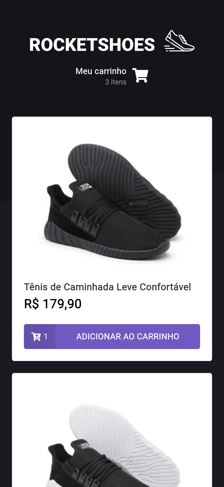
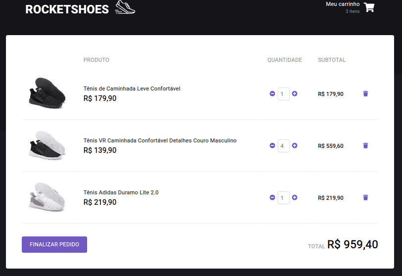

<h1 align="center">
    
</h1>

  

  

  

  

  

  

# Screens

## Home

## Home Responsive

## Cart

# Prerequisites

- Node
- Yarn

# Run the project

To run this project you need execute the following steps:

1. Clone the repository: `git clone git@github.com:MaykonOliveira/rocketshoes-vue.git`

2. Enter in the directory of the project: `cd rocketshoes-vue`

3. Install the dependencies: `yarn`

4. Init json-server: `yarn json-server --watch server.json`

5. Execute the project: `yarn start`

# Observations

- The backend used is provided by a `server.json` presente in the root of the project.

- Responsive layout created in the roots way.

# What are the next steps?

- [ ] Create a backend project with login.
- [ ] Create a checkout flux.
- [ ] Other things.

## License

MIT

See the [License](LICENSE) file.
